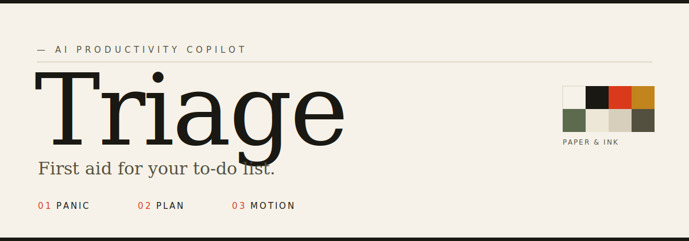
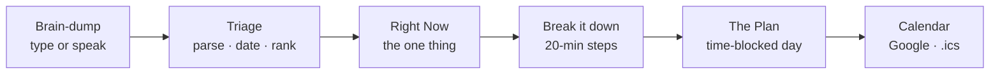
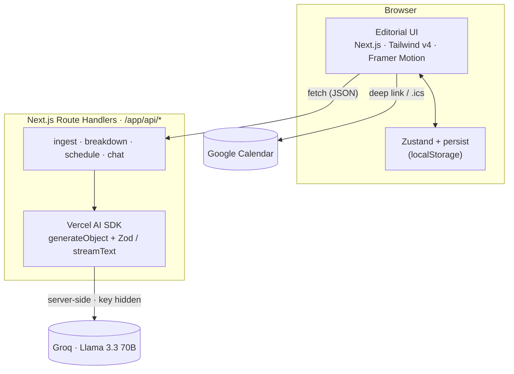

<div align="center">



<br/>

**An AI productivity copilot that turns a panicked brain-dump into a plan — what to do _right now_, and how to start.**

[](https://triage-plum.vercel.app)

[](https://nextjs.org)
[](https://www.typescriptlang.org)
[](https://tailwindcss.com)
[](https://www.framer.com/motion/)
[](https://sdk.vercel.ai)
[](https://groq.com)
[](#license)

</div>

---

## Overview

People miss deadlines less from laziness than from the absence of a plan. Ordinary to-do apps only *list* tasks — they never resolve a vague "Friday", weigh stakes against urgency, decide the single thing worth starting, or remove the friction of beginning.

**Triage** does. You dump everything you're avoiding (by typing or *speaking*); it parses the mess into dated, ranked tasks, names the one thing to start right now and why, breaks that into 20-minute steps, and lays the rest into a deadline-aware, time-blocked day you can push to Google Calendar.

It reads like a beautifully set newspaper, not a dashboard — and the AI runs server-side, so the key never reaches the browser.



## Demo

> **Live:** https://triage-plum.vercel.app — loads a fully seeded board instantly, no key required; add a Groq key for the live flow.

<!-- To add a screen recording, drop a capture at docs/demo.gif and uncomment:

-->

**60-second script:** open the app → clear the box → press the mic and *speak* your list → **Triage it** → read the ranked agenda → open **Right Now** and hit **Break it down** → scroll to **The Plan**, drag "Today I have" to 2 hours, **Re-plan** → **Add to Google Calendar**.

Sample brain-dump:

```text
calc problem set due Friday, 1500-word essay on the French Revolution due Monday,
call the dentist, rent due the 1st, prep for a 2pm interview Thursday
```

## Features

| Area | What it does |
| --- | --- |
| **Brain-dump** | One large editorial input: type, speak (live speech-to-text), drop or paste a **screenshot** of a syllabus/whiteboard, or **import an `.ics`** — all parsed into dated tasks. |
| **Triage board** | AI parses free text into dated, ranked tasks — type, effort estimate, importance/urgency, and a one-line editorial rationale; the list animates as it re-orders. |
| **Right Now** | The single highest-value task to start, the reason, and a first step doable in under five minutes. |
| **Break it down** | Decomposes the task into 3–8 concrete, startable steps as a checklist; optional read-aloud (text-to-speech). |
| **The Plan** | A realistic, no-overlap, deadline-aware time-blocked day; a "Today I have N hours" control re-plans on demand. |
| **Screenshot to tasks** | Drop a photo of a syllabus, planner, or whiteboard and a vision model (Llama 4 Scout) reads the tasks straight off the image. |
| **Conversational edits** | The copilot *acts* on your board — "I finished rent," "push the essay to Wednesday," "drop the dentist," "reflow the day" — via structured, validated actions, not just chat. |
| **Missed-block reflow** | When a block slips past its time and the task isn't done, Triage flags that you're behind and rebuilds the rest of the day from now. |
| **Focus mode** | A Pomodoro overlay for the task at hand — timer, break cycles, and its breakdown steps to tick off live. |
| **Streak** | A daily-completion streak strip that rewards showing up, persisted locally. |
| **Share card** | A one-click, dynamically generated Open Graph image of your plan (`next/og`), plus native share / copy. |
| **Calendar** | Per-block "Add to Google Calendar" deep links, plus a one-click `.ics` export — no OAuth. |
| **Proactive nudges** | Context-aware prompts from the current time, overdue work, and gaps in the plan. |
| **Polish** | Light / dark "ink" theme, WCAG-AA contrast, full keyboard support, reduced-motion safety, `localStorage` persistence, seeded demo data, and graceful AI errors. It never shows a blank screen. |

## Architecture



Every route validates with Zod, retries with backoff, and degrades gracefully — a failed call keeps the previous board and shows a quiet retry instead of a blank screen. The current datetime and timezone are passed into every prompt so relative dates resolve correctly.

| Route | Method | Purpose |
| --- | --- | --- |
| `/api/ingest` | POST | Parse + prioritize + pick "Right Now" in one round trip |
| `/api/breakdown` | POST | Decompose a task into startable steps |
| `/api/schedule` | POST | Lay tasks into a no-overlap, deadline-aware day (with a reflow mode) |
| `/api/command` | POST | Turn an instruction into validated actions that mutate the board |
| `/api/vision` | POST | Read tasks out of a screenshot (Llama 4 Scout, multimodal) |
| `/api/og` | GET | Render the shareable plan card as a PNG (`next/og`) |

## Tech Stack

| Layer | Choice |
| --- | --- |
| Framework | Next.js 15 (App Router) + TypeScript |
| Styling | Tailwind CSS v4 (CSS-first `@theme`, tokens as CSS variables) |
| Motion | Framer Motion (restrained, reduced-motion safe) |
| AI | Vercel AI SDK (`generateObject` + Zod, `streamText`) |
| Model | Groq · Llama 3.3 70B (text) + Llama 4 Scout (vision), isolated in one file, swappable to Anthropic / OpenAI |
| State | Zustand + `persist` to `localStorage` (no database) |
| Type | Fraunces · Geist · Geist Mono via `next/font` |
| Voice | Web Speech API (recognition + synthesis) |
| Hosting | Vercel |

## Getting Started

```bash
# 1. Install
npm install

# 2. Add a key (server-side only)
cp .env.local.example .env.local
#   then set GROQ_API_KEY=...   (free key at https://console.groq.com/keys)

# 3. Run
npm run dev        # http://localhost:3000
```

`npm run build` produces an optimized production build; `npm start` serves it.

The model lives in one file — [`src/lib/ai.ts`](src/lib/ai.ts) — so you can swap Groq for Anthropic Claude or OpenAI in a single line.

## Project Structure

```text
src/
  app/
    layout.tsx            fonts, theme bootstrap, metadata
    page.tsx              composition + AI wiring
    globals.css           design tokens + editorial type system
    api/{ingest,breakdown,schedule,chat}/route.ts
  components/             Masthead, BrainDump, RightNowCard, TriageBoard,
                          ThePlan, Nudges, Copilot, primitives, icons
  hooks/                  useMounted, useNow, useSpeech, useSpeak
  lib/                    ai, schemas, normalize, store, seed, calendar, utils
```

## Design System

Tokens live as CSS custom properties in [`globals.css`](src/app/globals.css) — `paper` `#F6F2E9`, `ink` `#1A1812`, vermilion `signal`, amber, calm — all AA-contrast and theme-portable. The look is hand-built: a masthead, hairline rules, large index numerals, dotted-leader deadlines, mono "kicker" labels, and marginalia. No component library, no generic SaaS aesthetic, no emoji. Vermilion is reserved for genuine urgency.

## Accessibility & Resilience

- WCAG-AA color contrast in both themes; visible focus rings; `aria` on all custom controls.
- `prefers-reduced-motion` honored throughout; voice input feature-detected.
- State persists across refresh; seeded data and graceful errors keep it demo-proof.
- Hydration-safe: deterministic dates render on the server, then re-anchor to "now" after mount.

## License

MIT — see [LICENSE](LICENSE).

<div align="center">

Built by **Samrat Talukdar** — panic, then plan, then motion.

</div>
